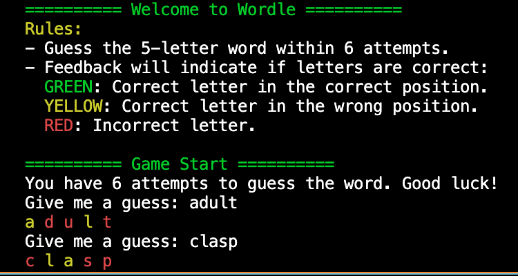
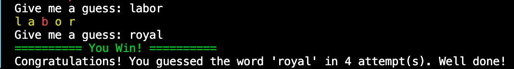

# Wordle Game - Python Implementation 🎮📚

This repository contains a Python implementation of the Wordle game. It is a simplified version of the popular online word game created by Josh Wardle. This project is designed for educational purposes, particularly as part of the ENSAT 2024/2025 curriculum.

## About the Game 🌟

In Wordle, players have six attempts to guess a five-letter word. After each guess, feedback is provided in the form of colored tiles:
- **🟩 GREEN**: The letter is correct and in the correct position.
- **🟨 YELLOW**: The letter is correct but in the wrong position.
- **🟥 RED**: The letter is incorrect.

The objective is to guess the word correctly within six attempts.

---

## Project Structure 🛠️

The project is modular, with each module performing a specific function:

### Modules 📦

#### 1. `display.py`
Handles the terminal output for the game, including instructions, feedback, and endgame prompts.

- **Functions:**
  - `game_instructions()`: Prints game instructions.
  - `game_start_display()`: Displays the starting message.
  - `display_win(word: str, attempt: int)`: Displays a winning message.
  - `display_lost(word: str)`: Displays a losing message.
  - `display_word_feedback(guess: str, feedback: List[str])`: Displays feedback for each guess with colored formatting.

#### 2. `word_choice.py`
Manages word selection from the `words.txt` file.

- **Functions:**
  - `read_words_file() -> List[str]`: Reads and returns all valid 5-letter words.
  - `choose_random_word(words: List[str]) -> str`: Selects a random word from the list.

#### 3. `validate_guess.py`
Validates user input to ensure it adheres to game rules.

- **Functions:**
  - `check_guess_valid(guess: str) -> bool`: Ensures the guess is a valid 5-letter lowercase word.
  - `get_valid_guess(all_words: List[str], guesses: List[str]) -> str`: Continuously prompts the user for a valid guess.

#### 4. `wordle.py`
Implements the core logic of the game.

- **Functions:**
  - `check_guess_correct(word: str, guess: str) -> bool`: Checks if the guess matches the word.
  - `feed_back_word(word: str, guess: str) -> List[str]`: Provides feedback for each letter in the guess.

### Assets 📂

- `wordle_package/assets/words.txt`: A text file containing 5-letter words, with one word per line.

---

## How to Run the Game 🖥️

### Prerequisites 📋
Ensure you have Python installed on your system.

### Steps 🚀
1. Clone the repository:
   ```bash
   git clone https://github.com/sh15935/Wordle-game
   cd wordle_lab
   ```

2. Run the game:
   ```bash
   python main.py
   ```

### Playing the Game 🎲
1. Follow the on-screen instructions to guess a word.
2. Enter valid 5-letter words.
3. Use the feedback to refine your guesses.
4. Win the game by guessing the word within six attempts! 🏆

---

## Example Output 🖨️





---

## Contributing 🤝
Contributions are welcome! Feel free to fork the repository and submit a pull request.

---

## License 📜
This project is licensed under the MIT License. See `LICENSE` for details.

---

## Acknowledgements 🙌
This implementation is based on the original Wordle game created by Josh Wardle. Special thanks to ENSAT for providing the opportunity to develop this project.

Safae SAHIH
